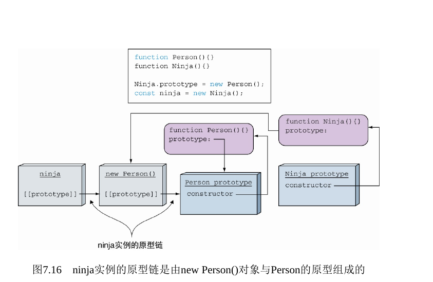

# 第七章 面向对象与原型

## 内容：

- 探讨原型
- 使用函数作为构造器
- 使用原型扩展对象
- 避免常见的问题
- 使用继承创建类

### 7.1 理解原型

### 7.3 实现继承

```js
function Person() {}

Person.prototype.dance = function () {
  console.log('dance')
}

function Ninja() {}

// 只是复制了dance
// Ninja.prototype = { dance: Person.prototype.dance }

// 通过将Ninja原型构造器赋值给Person实例，实现继承
Ninja.prototype = new Person()

const ninja = new Ninja()

console.log(ninja.dance())
console.log(ninja instanceof Ninja)
console.log(ninja instanceof Person) // false 所以没有继承到Person
console.log(ninja instanceof Object)
```

> ```js
> 问题：
> console.log(ninja.constructor === Ninja) //false
> // 这里ninja.constructor指向了Person
>
> 解决方法：重新建立 ninja 和 Ninja 的联系
> Object.defineProperty(Ninja.prototype, 'constructor', {
>   enumerable: false,
>   value: Ninja,
>   writable: true,
> })
> ```

#### 7.3.2 instanceof 操作符



### Class

> 构造函数的语法糖
> static 方法不能由实例访问，只能是本身访问
> extends 关键字继承 super 关键字调用基类
