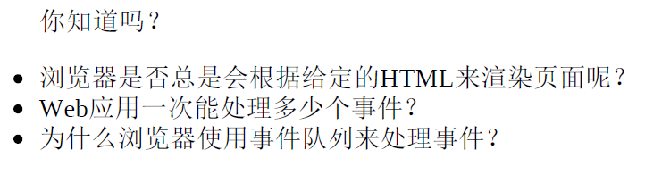
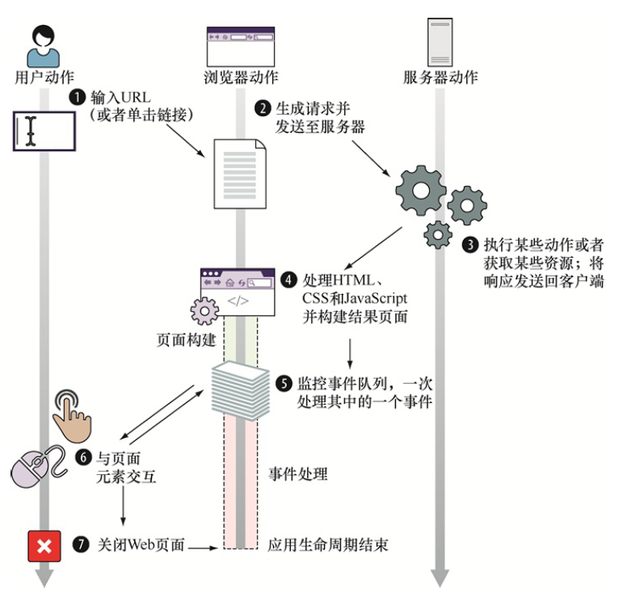
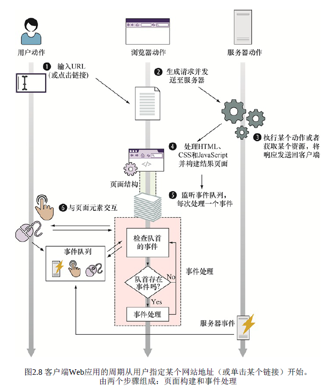
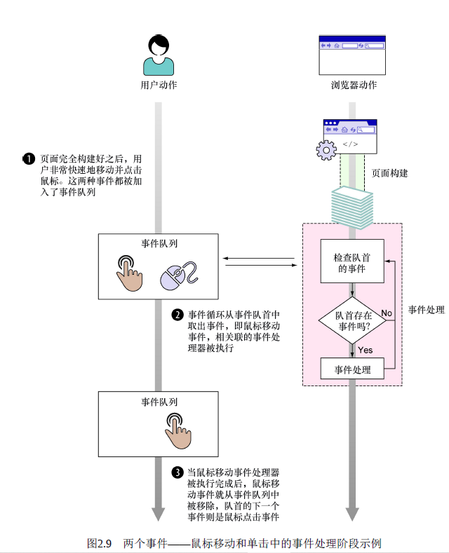

# 第二章

## 问题：

---

## 正文：

### 1. 输入 URL 之后的过程

> 要点：

1. 监控时间队列，一次处理其中一个事件
2. 关闭 Web 界面，应用于生命周期结束

---

### 2. 处理 HTML 和 CSS，执行 JavaScript 代码过程

- 根据返回的 HTML，生成 DOM 树的蓝图，并不一定完全按照该蓝图渲染
- 在渲染 HTML 过程中，遇到 JavaScript 元素，停止渲染执行 JS 代码

---

### 3. JavaScript 中的全局对象

- 浏览器暴露给 JavaScript 的主要全局对象是 window 对象，window 对象最重要的属性是 document
- **重点** ： 只要还有没处理完的 HTML 和 JavaScript 代码，下面两个步骤就会一直执行，而且此时 JavaScript 会保持**全局状态**，原因是 window 对象存在于整个页面的生存期
  1. 将 HTML 构建成 DOM
  2. 执行 JavaScript 代码

---

### 4. 事件处理

1. 事件队列
   > 浏览器需要跟踪以发生但是没有处理的事件，无论是用户产生的还是服务器生成的，都放在一个事件队列中

> 重点注意浏览器在这个过程中的机制，其放置事件的队列是在页面构建阶段和事件处理阶段以外的。这个过程对于决定事件何时发生并将其推入事件队列很重要，这个过程不会参与事件处理线程

---

2. 事件处理器 -- addEventListener
   

---

## 小结

- 浏览器接收的 HTML 代码用作创建 DOM 的蓝图，它是客户端 Web 应用结构的内部展示阶段
- 我们使用 JavaScript 代码来动态地修改 DOM 以便给 Web 应用带来动态行为
- 客户端 Web 应用的执行分为两个阶段
  - 页面构建：创建 DOM，执行 JavaScript
  - 事件处理：进入事件队列，调用相应的事件处理器

---

## 练习：

1. 客户端 Web 应用的两个生命周期是什么？
   > answer : 页面构建和事件处理
2. 相比将事件处理器赋值给某个特定元素的属性上，使用 addEventListener 方法来注册事件处理器的优势是什么？
   > answer : 可以注册多个事件处理器
3. JavaScript 引擎在同一时刻能处理多少个事件
   > answer : 一个
4. 事件队列中的事件是以什么顺序处理的？
   > 查找队列头，如果没有队列头则继续遍历队列，如果有就取出事件并调用对应的事件处理器，余下事件等待
