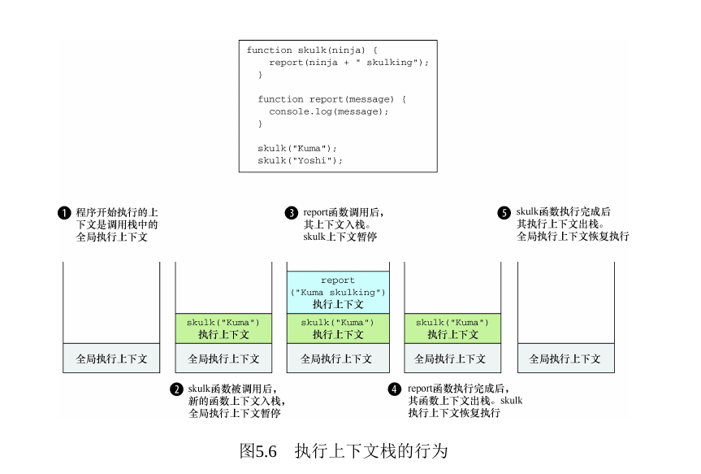
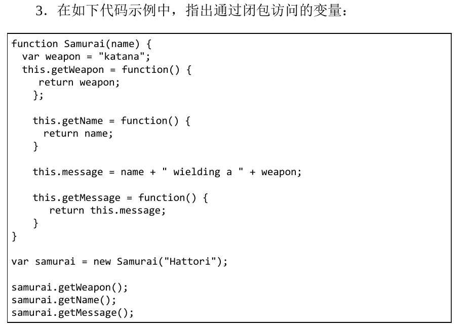
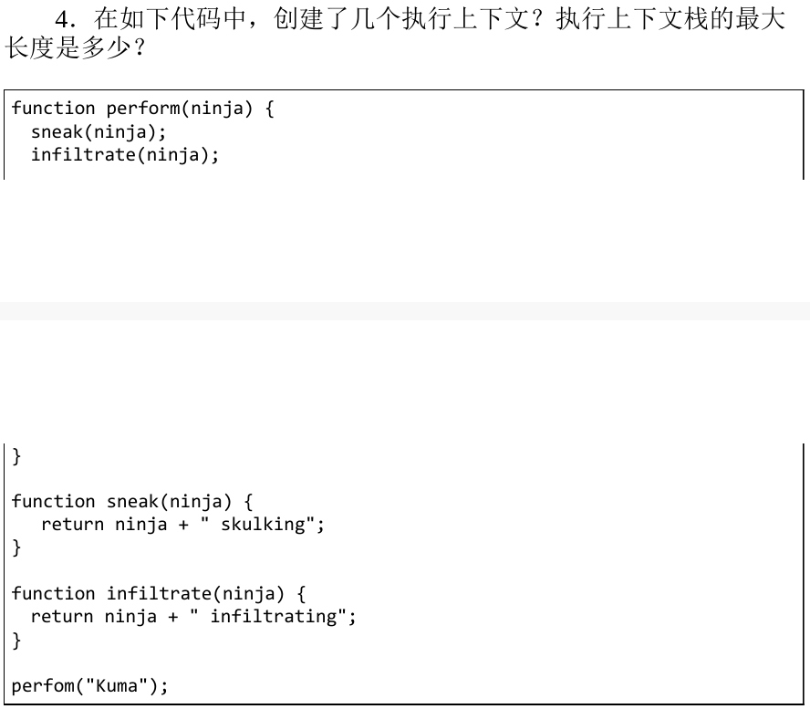
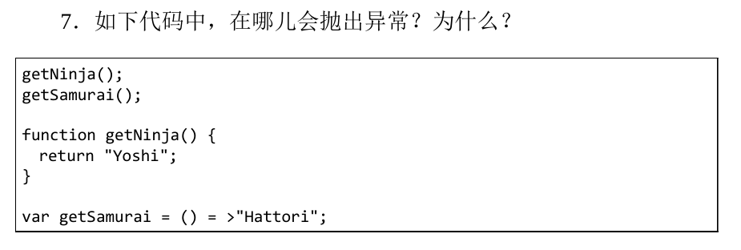

# 第五章 精通函数：闭包和作用域

> 主要内容

- 使用闭包简化代码
- 使用执行上下文跟踪 JavaScript 程序的执行
- 使用词法环境（Lexical Environment）跟踪变量的作用域
- 理解变量的类型
- 探讨闭包的工作原理

## 执行上下文

1. 每个 JavaScript 只创建一个全局执行上下文
   > 

# 练习

1. (false) 闭包允许函数（ a ）。a．访问函数创建时所在的作用域内的变量 b．访问函数调用时所在的作用域内的变量
2. 闭包是(b) a．消耗代码成本 b．消耗内存成本 c．消耗处理成本
3. (false) 
   > a: weapon name (message 是对象，不是变量)
4. 
   > a: 四个执行上下文 执行上下文栈最大长度是 3
5. const
6. var 和 let 的区别
   > - let 不存在变量提升, let 声明后才能使用
   > - 相同作用域内 let 不能重复声明
7. 
   > a: line2 undefiend 函数表达式不能在声明前调用
