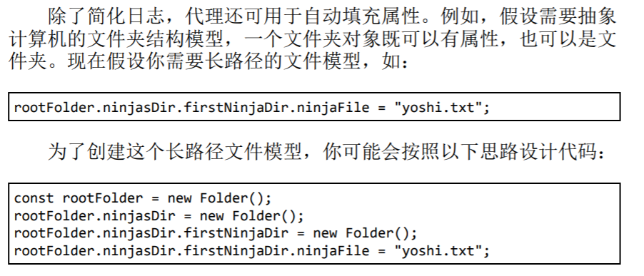

# 第八章 控制访问对象集合

- 使用 getter 和 setter 控制访问对象的属性
- 通过代理控制对象的访问
- 使用代理解决交叉访问的问题

1. 通过 getter 和 setter 访问属性值有什么好处？
2. 代理与 getter 和 setter 的主要区别是什么？
3. 代理对象的常见问题是什么？列举 3 项代理对象的常见问题。

### 8.1 使用 getter 和 setter 控制属性访问

##### 1. 保护私有属性

只能通过方法来获取和设置值

```js
function Ninja() {
  let skillLevel
  this.getSkillLevel = () => skillLevel

  this.setSkillLevel = (value) => {
    skillLevel = value
  }
}
const ninja = new Ninja()
ninja.setSkillLevel(100)
```

##### 2. 定义 getter 和 setter

- 通过对象字面量定义，或在 ES6 的 class 中定义
- 通过使用内置的 Object.defineProperty 方法

**Object.defineProperty()**

实现私有变量

```js
function Ninja() {
  let _skillLevel
  Object.defineProperty(this, 'skillLevel', {
    get: () => {
      return _skillLevel
    },
    set: (value) => {
      return (_skillLevel = value)
    },
  })
}
const ninja = new Ninja()
ninja.skillLevel = 10 // 隐式调用set方法
```

通过 get set 方法创建了含有私有变量的闭包，只能通过 get set 访问私有变量

##### 3. 使用 getter setter 校验属性值

校验是否为整数： [8.1](./使用getter和setter/index.js)

```js
function Ninja() {
  let _skillLevel
  Object.defineProperty(this, 'skillLevel', {
    get: () => {
      return _skillLevel
    },
    set: (value) => {
      if (!Number.isInteger(value)) {
        throw new TypeError('only number')
      }
      _skillLevel = value
    },
  })
}
const ninja = new Ninja()
ninja.skillLevel = 12
```

##### 4. 使用 getter setter 计算属性值

当一个值取决于内部状态

### 8.2 使用代理控制访问 Proxy

```js
/* 
  target: 要使用Proxy包装的对象
  handler: 一个通常以函数作为属性的对象，各属性中的函数分别定义了在执行各种操作时代理 p 的行为
*/
const p = new Proxy(target, handler)
```

基本使用方法：

```js
const ninja = { skillLevel: 10 }

const p = new Proxy(ninja, {
  get: (target, key) => {
    console.log(target, key) //{ skillLevel: 10 } skillLevel
    return target.skillLevel
  },
  set: (target, key, value) => {
    target[key] = value
  },
})

console.log(p.skillLevel)
console.log((p.skillLevel = 3))
console.log(p.skillLevel)
```

> 当直接使用 ninja.skillLevel 时直接访问 ninja 的属性，
> 当使用 p.skillLevel 时，隐式调用代理的 get 方法，同样返回 ninja 的 skillLevel 属性

##### 1. 使用 proxy 记录日志

get()拦截某个属性的读取操作
set()拦截某个属性的赋值操作

```js
function makeLoggalbe(target) {
  return new Proxy(target, {
    get: (target, property) => {
      return target[property]
    },
    set: (target, property, value) => {
      target[property] = value
    },
  })
}

let ninja2 = { name: 'zhuqd' }
ninja2 = makeLoggalbe(ninja2)
console.log(ninja2)
```

##### 2. 使用 proxy 测试性能

apply()方法拦截对函数的调用

```js
function isPrime(number) {
  if (number < 2) return false
  for (let i = 2; i < number; i++) {
    if (number % i !== 0) return false
  }
  return true
}

isPrime = new Proxy(isPrime, {
  /**
   * @description: handle.apply()
   * @param target: 目标函数
   * @param thisArg: 被调用时执行上下文对象
   * @param argumentList: 被调用时参数数组
   */
  apply: (target, thisArg, args) => {
    console.time('isPrime')

    const result = target.apply(thisArg, args)
    console.timeEnd('isPrime')

    return result
  },
})

console.log(isPrime(1299827))
```

##### 3. 使用 proxy 自动填充属性



##### 4. 使用 proxy 实现负数组的索引

```js
const arr = ['Yoshi', 'Kuma', 'Hattori']
console.log(arr[-1]) // undefined
function createNegativeArrayProxy(array) {
  if (!Array.isArray(array)) {
    throw new TypeError('only array')
  }

  return new Proxy(array, {
    get: (target, index) => {
      index = +index // .....转正，不然负数下面不就报错了
      return target[index < 0 ? target.length + index : index]
    },
    set: (target, index, value) => {
      index = +index
      return (target[index < 0 ? target.length + index : index] = value)
    },
  })
}

const arr2 = createNegativeArrayProxy(arr)
console.log(arr2[-2]) // 'Kuma'
arr2[-3] = 'YoYo'
console.log(arr2[-3]) // 'YoYo'
```

##### 5. proxy 的性能消耗

谨慎使用代理

### 8.3 小结

- 使用 getter setter proxy 访问设置属性
- proxy 可以定制对象交互时的行为
- 所有的交互行为必须通过 proxy，指定的行为会在发生时调用方法(get,set,apply 等)
- 代理实现： 日志打印，性能测量，数据校验，负索引数组
- 代理效率不高，谨慎使用

### 8.4 练习
