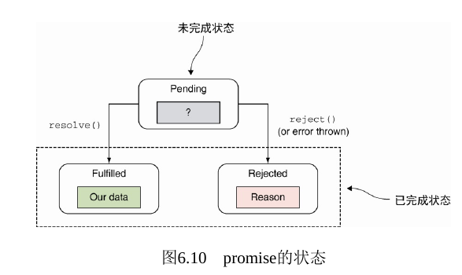

# 第六章 生成器和 Promise

## Question:

> - 生成器函数的作用
> - 在异步代码中，为什么使用 promise 比使用简单的回调函数更好？
> - 使用 Promise.race 来执行很多长期执行的任务时，promise 最终会在什么时候变成 resolved 状态？它什么时候会无法变成 resolved 状态？

## 深入 promise

> promise 对象用于作为异步任务结果的占位符
> 

### 1. 拒绝 promise

1. promise 实例的 then 的第二个回调参数 error 总会被调用
2. 也可以用 catch 捕捉 promise 的 error
3. 或者出现异常隐式拒绝 promise

### 2. 链式调用 promise

### 3. 等待多个 promise -- Promise.all([])

使用 Promise.all([])等待多个 promise
当 all 中所有 promise 都成功该 promise 变成成功状态，有一个失败则为失败状态

### 4. promise 竞赛 -- Promise.race([])

一旦数组中有一个 promise 被处理或者失败，该 promise 就会变成处理或者失败

## 小结

1. 生成器是一种不会在同时输出所有值序列的函数，而是基于每次的请求生成值。
2. 不同于标准函数，生成器可以挂起和恢复它们的执行状态。当生成器生成了一个值后，它将会在不阻塞主线程的基础上挂起执行，随后静静地等待下次请求。
3. 生成器通过在 function 后面加一个星号（*）来定义。在生成器函数体内，我们可以使用新的关键字 yield 来生成一个值并挂起生成器的执行。如果我们想让渡到另一个生成器中，可以使用 yield*操作符。
4. 在我们控制生成器的执行过程中，通过使用迭代器的 next 方法调用一个生成器，它能够创建一个迭代器对象。除此之外，我们还能够通过 next 函数向生成器中传入值。
5. promise 是计算结果值的一个占位符，它是对我们最终会得到异步计算结果的一个保证。promise 既可以成功也可以失败，一旦设定好了，就不能够有更多改变。
6. promise 显著地简化了我们处理异步代码的过程。通过使用 then 方法来生成 promise 链，我们就能轻易地处理异步时序依赖。并行执行多个异步任务也同样简单：仅使用 Promise.all 方法即可。
7. 通过将生成器和 promise 相结合我们能够使用同步代码来简化异步任务。
