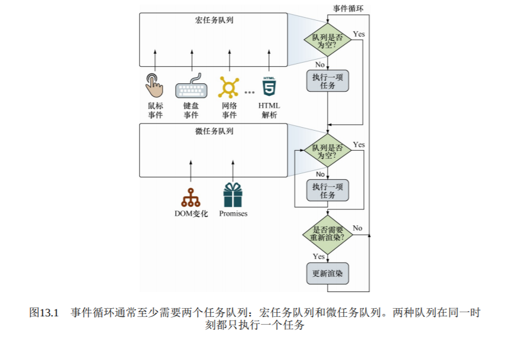

# 第十三章 历久弥新的事件

## 主要内容

- 了解事件循环
- 使用计时器处理复杂任务
- 使用计时器管理动画
- 使用事件冒泡和委派
- 使用自定义事件

## 问题

- 为什么不能保证定时器回调的时机？
- 如果 setInterval 定时器每 3ms 执行一次，而事件处理程序需要运行
  16ms，那么定时器的回调函数将被添加到微任务队列中多少次？
- 为什么事件处理程序的函数上下文有时与事件的目标不同？

### 13.1 深入事件循环

事件循环实现至少应该包含一个用于宏任务的和至少一个用于微任务的队列

> - 一次只处理一个任务
> - 一个任务开始直到完成，不会被其他任务打断

- (宏任务：包括创建主文档对象、解析 HTML、执行主线或全局）JavaScript 代码，更改当前 URL 以及各种事件，如页面加载、输入、网络事件和定时器事件)
- (微任务：promise 回调函数，DOM 变化)

事件循环将首先检查宏任务队列，如果宏任务等待，则立即开始执行宏任务。直到该任务运行完
成（或者队列为空），事件循环将移动去处理微任务队列。如果有任务
在该队列中等待，则事件循环将依次开始执行，完成一个后执行余下的
微任务，直到队列中所有微任务执行完毕。注意处理宏任务和微任务队
列之间的区别：单次循环迭代中，最多处理一个宏任务（其余的在队列
中等待），而队列中的所有微任务都会被处理。

当微任务队列处理完成并清空时，事件循环会检查是否需要更新 UI
渲染，如果是，则会重新渲染 UI 视图。至此，当前事件循环结束，之后
将回到最初第一个环节，再次检查宏任务队列，并开启新一轮的事件循
环。

要点：

1. 两个任务队列都独立于事件循环，意味中可以在事件循环中向任务队列添加任务
2. JS 单线程决定任务开始执行到完成，不会被其他任务中断。除非浏览器决定终结任务(超时或占用过大内存)
3. 所有微任务会在下一次渲染之前执行完成，因为它们的目标是在渲染前更新应用程序状态
4. 浏览器通常帧数 60fps，所以单个任务和该任务附属的所有微任务，都应在 16ms 内完成。

注意：

> 请注意事件处理函数的发生频率以及执行耗时。例如，处理鼠标移动（mouse-move）事
> 件时应当特别小心。因为移动鼠标将导致大量的事件进入队列，因此在鼠标移动的处理函数
> 中执行任何复杂操作都可能导致 Web 应用的糟糕体验。

##### 1. 仅含宏任务的示例

.png>)

##### 2. 同时含有宏任务和微任务的示例

> 微任务无法停止，无法中途添加(当然...)

### 13.2 计时器

setInterval setTimeout

##### 1. 在事件循环中执行计时器
